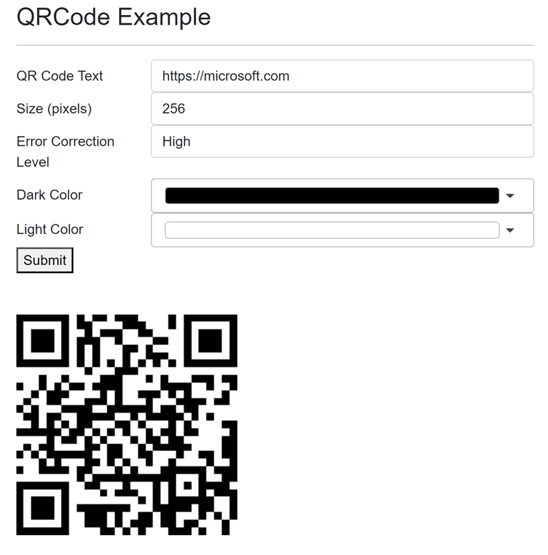

# Blazor.QrCodeGen

## Introduction

I have used [QRCode.js](https://github.com/davidshimjs/qrcodejs) as a base for the blazor QR code component. 
In your Blazor WASM application, you can use the Blazor component to generate QR codes without Java script. We support version .NET 8.0+  
Try [demo application ](https://blazorqrcodedemo.azurewebsites.net/)


## Prerequisites

To create Blazor Apps, install the latest version of Visual Studio with the ASP.NET and web development workload.
For using .Net 8.0 you need at least Visual Studio 2022 17.8+.
Another alternative would be to use Visual Studio code. Click [here](https://docs.microsoft.com/en-us/aspnet/core/blazor/get-started?view=aspnetcore-3.1&tabs=visual-studio-code) for more information.


## Getting Started

### Installation

 - Install the latest NuGet Package

 Using Package Manager
```
Install-Package Blazor.QrCodeGen
```

 Using .NET CLI
```
dotnet add package Blazor.QrCodeGen
```

 Using MS VS Manage NuGet Packages search for `Blazor.QrCodeGen`

 - Add dependencies

 You need to add 2 lines into index.html
```html
    <script src="./_content/Blazor.QrCode/qrcode.min.js"></script>
    <script type="module" src="./_content/Blazor.QrCode/qrcodeInterop.js"></script>
```

### Usage

Simple use with default settings:
```csharp
<QrCode CanvasId="AnyId" Text="Any text"/>
```

Using with text and size in pixel:
```csharp
<QrCode CanvasId="AnyId" Text="Any text" Size="64"/>
```

Using with customized settings:
```csharp
<QrCode CanvasId="AnyId" Text="Any text" Options="_options" />
@code{
 private QrCodeOptions _options = new QRCodeOptons(){Color = Color.Blue};
}
```

> **Note:** If you set both Size for Attribute and Options, then Attribute takes precedence.


## Options

| Name | Default |
|--------|--------|
| Size  | 256    |
| ColorDark | Black  |
| ColorLight | White |
| ErrorCorrectionLevel | High|

## Features

Blazor component for QR code generation. You can change:
 - Text
 - Size
 - Colors
 - Error correction level

## Releases
1.1 Added property Size  
1.0 Initial .Net8.0 release  